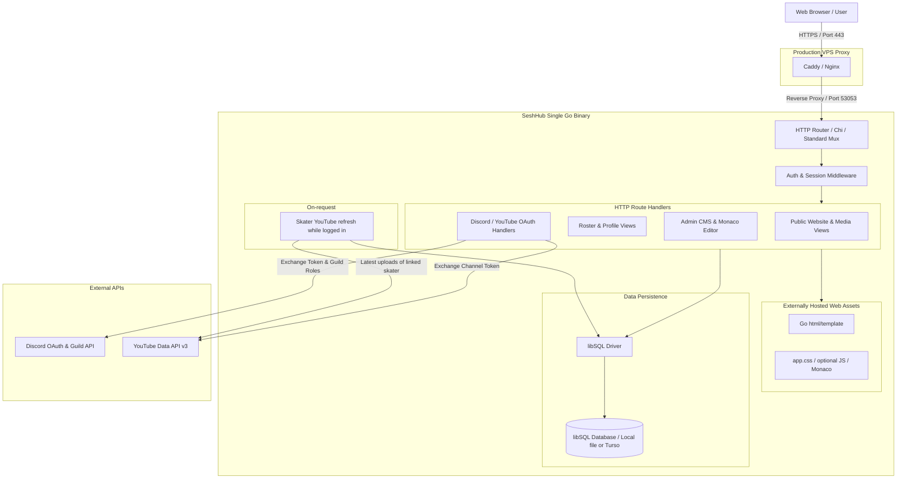

# SeshHub

SeshHub is the website and CMS for **Sesh Sofa** and the fakeskate scene. One Go process, a SQLite file, templates on disk. Public FS Team (Discord skater role), Friends (Discord friends role, queue approval, or former members), news, videos, custom pages, and a signed-in Forum. Login is Discord or YouTube only — no passwords. Discord guild roles (plus a superadmin list) decide who is admin, skater, or friend; everyone else can request access.

Local default listen address is **port 53053**. That port is yours. Don't let a Clanker steal it; they use `-port`.

---

## Meat Bag: get it running

### What you need

- [Go](https://go.dev/dl/) 1.22+ on `PATH`
- [just](https://just.systems/) (optional; `go run` / `go test` work without it)
- A Discord application if you want login
- A Google Cloud OAuth client if you want YouTube login

No Node, no C compiler, no Docker.

### First boot

From the repo root (PowerShell):

```powershell
copy .env.example .env
just deps
just test
just dev
```

Linux / macOS:

```sh
cp .env.example .env
just deps
just test
just dev
```

Without just:

```powershell
copy .env.example .env
go mod tidy
go test ./...
go run ./cmd/server
```

```sh
cp .env.example .env
go mod tidy
go test ./...
go run ./cmd/server
```

Open [http://localhost:53053](http://localhost:53053). Schema is applied on start into `seshhub.db`. Login buttons stay disabled until OAuth client id **and** secret are set.

Useful flags (override `.env`):

```powershell
just dev -port 127.0.0.1:53054 -db file:scratch.db
```

`-port` accepts `53054` or `host:port`. `-web` points at the `web/` folder if you moved it.

Set `BASE_URL` to the same origin you type in the browser (`http://localhost:53053`). OAuth redirect URIs must match that origin exactly.

### Discord login and roles

1. [Discord Developer Portal](https://discord.com/developers/applications) → New Application.
2. **OAuth2 → Redirects**: add `http://localhost:53053/auth/discord/callback` (and later the production URL).
3. Copy **Client ID** and **Client Secret** into `DISCORD_CLIENT_ID` / `DISCORD_CLIENT_SECRET`.
4. Enable **Developer Mode** in Discord (Settings → Advanced). Right-click the Sesh Sofa server → Copy Server ID → `DISCORD_GUILD_ID`.
5. Server Settings → Roles → right-click hub admin, hosts, skater, and friends → Copy Role ID → `DISCORD_HUB_ADMIN_ROLE_ID` / `DISCORD_HOSTS_ROLE_ID` / `DISCORD_SKATER_ROLE_ID` / `DISCORD_FRIENDS_ROLE_ID`.
6. Right-click **your** user → Copy User ID → `SUPERADMIN_DISCORD_IDS` (comma-separated if more than one). That list is hub admin even without the guild hub-admin role, so you can log in the first time.

Scopes used: `identify`, `guilds.members.read`. Restart the server after saving `.env`. Sign in with Discord. Guild hub-admin role or superadmin → **admin**. Hosts role → can edit Spot and Episodes (independent of admin). Skater role → **skater**, and a `/team` profile is created (Discord name, linked user id). Friends role → **friend**, and a `/friends` profile is created. In the guild with none of those roles → **pending** (request access at `/access`; approve at `/admin/access` grants **friend**, not team). Not in the guild → **pending** as well (login still succeeds). Duplicate Discord/YouTube users: superadmin **Admin → Users** → Merge from into the Discord row. Re-login with Discord after a hosts-role change. Existing `member` rows migrate to **friend**; on Discord login, `DISCORD_SKATER_ROLE_ID` still promotes them to team.

### Discord bot

Same Discord application. **Bot → Reset Token** → `DISCORD_BOT_TOKEN` (not the OAuth client secret). Invite the bot to the Sesh Sofa server with the **bot** scope and **Send Messages**. Under **Bot → Privileged Gateway Intents**, turn on **Message Content Intent**. Without that the gateway closes the bot, and the home channel arrives with no text. Empty token means no gateway and no posts.

**Admin → Discord bot** (`/admin/bot`): token set or missing, gateway (connecting / connected / disconnected), bot username, heartbeat latency, whether it is in `DISCORD_GUILD_ID`, last error, and an in-memory activity list (connects, disconnects, posts). **Home channel** is where the bot listens. Other channels are ignored unless someone @mentions the bot or replies to it. None means it does not listen. Message text is not stored. A second dropdown is the announce channel (text channels the bot can post in), with an on/off switch each for new public news, new forum threads, and access requests. All off until an admin enables them. An empty announce channel posts nothing. The activity list is cleared when the process stops.

News posts the title and `/news/…` URL the first time an article becomes published, and only if it is public. A later edit does not post again. Unpublishing and publishing again does. Forum posts the thread title and the thread URL — not the body, attachments, or the author's name. Access posts the requester's display name and username when they submit `/access`. A forum @mention, when that switch is on, pings the person's linked Discord account and the author's, and includes the thread title and URL. The post body is not sent. Someone without Discord linked is not pinged. Editing a post pings only mentions that were not already on it.

### YouTube login and skater videos

One Google OAuth client. That is login, linking a channel, and (for team skaters and friends) refreshing their latest public uploads onto their profile and `/videos`.

1. [Google Cloud Console](https://console.cloud.google.com/) → new project (or reuse one).
2. Enable **YouTube Data API v3** (OAuth calls it).
3. Credentials → **OAuth client ID** → Web application.
4. Authorized redirect URI: `http://localhost:53053/auth/youtube/callback`.
5. Copy client id/secret → `YOUTUBE_CLIENT_ID` / `YOUTUBE_CLIENT_SECRET`.
6. OAuth consent screen: add yourself as a test user while the app is in Testing.
7. Scope: `https://www.googleapis.com/auth/youtube.readonly`. We ask offline access so we can refresh uploads while the skater is logged in.

YouTube-only accounts start as **pending**. After YouTube login we send you to `/access` and ask whether you want Friends on Sesh Hub. Yes → admin queue at `/admin/access`. No → the pending account is deleted. After an admin approves they become **friend** with a public `/friends` profile labelled **Sesh Hub Friend** until Discord is linked. They cannot be made team skaters from the queue — team requires Discord `DISCORD_SKATER_ROLE_ID`. Admin reject of a YouTube-only request deletes the account; the next YouTube login shows a one-shot denial notice, then they can request again. Discord-first users connect YouTube from **Account**. Re-using a Discord or YouTube identity already on another SeshHub user is rejected.

Team skaters (`DISCORD_SKATER_ROLE_ID`) and friends (Discord friends role, queue approval, or a migrated former member) with a linked YouTube channel: while they are logged in, SeshHub pulls up to 50 latest **public** uploads (at most once an hour) onto `/team/{slug}` or `/friends/{slug}` and the public `/videos` list. Those roster grids and `/videos` paginate 6/12/18/24 (default 6) via `?n=&p=`. Guests see the last snapshot. Team profiles are created on Discord skater/admin login; friend profiles on friends-role login, queue approve, or the member→friend migration.

Restart after `.env` changes. Production: add the live `https://…/auth/…/callback` URIs and set `APP_ENV=production` and `BASE_URL` to the public https origin.

### YouTube stats poller (API key, not OAuth)

OAuth only refreshes a channel when that skater is signed in. To keep title, channel name, views, likes, and comment **counts** current on clips already on the site, you need a Data API key. Empty key = poller off. This is not a site-wide channel crawler; it only hits IDs in `youtube_videos`.

1. Same Google Cloud project as the OAuth client is fine.
2. Enable **YouTube Data API v3** if it is not already.
3. **APIs & Services → Credentials → Create credentials → API key**.
4. Restrict the key: API restriction **YouTube Data API v3**. In production, also IP-restrict to the Amsterdam VPS.
5. Put it in `.env` under its own block as `YOUTUBE_DATA_API_KEY` (see `.env.example`). Do not paste it into `YOUTUBE_CLIENT_SECRET`.
6. Bounce `just dev` / the production process. Logs should show `youtube poll updated=N` once an hour (and once at boot).

Quota is cheap: `videos.list` is 1 unit per 50 IDs. We do not download comments, only the count. Zero counts are hidden in the UI.

### Day-to-day

| Want | Do |
| :--- | :--- |
| Run it | `just dev` (port **53053**) |
| Tests | `just test` |
| Native binary | `just build` → `bin/seshhub` on Linux, `dist/seshhub.exe` on Windows |
| Clean binaries | `just clean` → drops `bin/` and `dist/` |
| Linux binary from Windows | see [Cross-compilation](#cross-compilation) |
| Status of the repo | `git log` |
| Duplicate Discord + YouTube accounts | Superadmin **Admin → Users** → Merge from (folded per row) the spare into the Discord user |

---

## Specification

The rest of this file is the architecture spec (what the system is supposed to be). Code wins when they disagree. History is `git log`.

## Table of Contents

0. [Meat Bag: get it running](#meat-bag-get-it-running)
1. [Project Overview & Core Principles](#project-overview--core-principles)
2. [Technology Stack](#technology-stack)
3. [System Architecture](#system-architecture)
4. [Authentication & Authorization (RBAC)](#authentication--authorization-rbac)
5. [Core Functional Modules](#core-functional-modules)
   - [Skater Profiles & Team Roster](#1-skater-profiles--team-roster)
   - [YouTube clips from skaters](#2-youtube-clips-from-skaters)
   - [Articles, News & Blog CMS](#3-articles-news--blog-cms)
   - [Custom Static Pages](#4-custom-static-pages)
   - [Special page: Spot](#special-page-spot)
   - [Special page: Episodes](#special-page-episodes)
   - [Admin UI & Markdown editor](#5-admin-ui--markdown-editor)
   - [Forum](#6-forum)
6. [Data Models & Database Schema (libSQL)](#data-models--database-schema-libsql)
7. [Project Directory Layout](#project-directory-layout)
8. [Configuration & Environment Variables](#configuration--environment-variables)
9. [Development & Build Workflows](#development--build-workflows)
10. [Production Deployment & Reverse Proxy](#production-deployment--reverse-proxy)
11. [AI Agent Engineering Guidelines](#ai-agent-engineering-guidelines)

---

## Project Overview & Core Principles

SeshHub is engineered around specific design principles:

- **Separately Hosted Web Assets**: HTML templates, CSS, JavaScript assets, icons, and SQL migrations are loaded from the configured web and migrations folders at runtime. This keeps the Go server binary separate from content and presentation changes, so templates and assets can be updated without rebuilding the binary.
- **Cross-Platform Parity**: Developed locally on **Windows** and deployed directly to **Linux** VPS instances. Paths, file separators, and system calls must remain platform-agnostic.
- **No Passwords / Pure OAuth**: User identity is federated exclusively through **Discord** and **YouTube** OAuth 2.0. No password hashes, email verification loops, or reset tokens are stored.
- **Discord Guild-Driven RBAC**: Permissions (Admin, Team Skater, Friend) are resolved from Discord guild roles. Users who do not match those roles, including YouTube-authenticated users, can request access; approval grants Friend, not Team.
- **Embedded libSQL Database**: Operates using embedded SQLite-compatible libSQL (file-backed locally, optionally synced to Turso Cloud in production) with zero external database server overhead.
- **Server-Driven Dynamic UI**: Frontend powered by Go standard `html/template` and a single hand-written stylesheet (`web/static/css/app.css`). HTMX / Alpine.js only if a page actually needs them.

---

## Technology Stack

| Layer | Technology | Description |
| :--- | :--- | :--- |
| **Backend Runtime** | [Go (Golang)](https://go.dev/) (1.22+) | High-throughput, low-memory HTTP server and background worker engine. |
| **Database** | [libSQL](https://github.com/tursodatabase/libsql) | Production-grade SQLite fork supporting embedded local files and Turso cloud replication. |
| **Templating** | Go `html/template` | Standard library server-side rendered HTML with strict context-aware escaping. |
| **Interactivity** | [HTMX](https://htmx.org/) + [Alpine.js](https://alpinejs.dev/) | Declarative AJAX swaps, inline element updates, modal dialogs, and UI toggles. |
| **Styling** | Hand-written CSS | Dark neon palette in `web/static/css/app.css`. No CSS framework. |
| **Content Editor** | [Monaco Editor](https://microsoft.github.io/monaco-editor/) (CDN) + textarea | Basic markdown + live goldmark preview; Advanced overlay loads Monaco from jsDelivr. |
| **Identity & Auth** | Discord & YouTube OAuth 2.0 | Decentralized authentication with Discord Guild API role validation. |
| **Media** | YouTube Data API v3 via skater OAuth | Latest uploads from linked skater channels while they are logged in. |

---

## System Architecture



---

## Authentication & Authorization (RBAC)

### Authentication Flow
1. **Login Initiation**: User opens `/login` (Sesh Hub button in the header) and selects **Discord** or **YouTube**.
2. **State & PKCE**: A cryptographic `state` token is generated and stored in a short-lived, encrypted session cookie to prevent CSRF.
3. **OAuth Callback**:
   - For **Discord**: Exchange authorization code for token, fetch Discord user profile (`/users/@me`), and fetch guild member status (`/users/@me/guilds/{guild_id}/member`).
   - For **YouTube**: Exchange authorization code for Google token and retrieve Google/YouTube user and channel identity.
4. **Account Upsert or Link**: Logged out → find or create in `users`. Logged in → attach the other provider to the current user (`discord_id` / `youtube_channel_id`) unless that identity is already on another row.
5. **Session Generation**: A high-entropy session token is generated; only its SHA-256 hash, user id, expiry, and created_at go in `sessions`. No IP or User-Agent. The plain token is returned in a secure, `HttpOnly`, `SameSite=Lax` cookie (`seshhub_session`).

### Role-Based Access Control (RBAC)

Users who do not match a Discord guild role (hub-admin, skater, or friends), as well as users authenticated through YouTube, can request access. YouTube-only login is sent to `/access` and asked whether to request Friends on Sesh Hub. Requests remain pending until a site admin reviews them in the admin UI. Approval grants **friend** and does not grant Admin or Team Skater. Team still requires Discord. Rejecting a YouTube-only request deletes that account; the next YouTube login shows a one-shot notice. Discord-linked rejects stay on the account as `rejected`.

`users.role` is a rank: **admin > skater > friend** (legacy `member` counts as friend). Discord login keeps the highest matching guild role. **Host** is `users.host`, not a rank — Spot/Episodes only, not granted by superadmin, and can sit on any of those roles.

| Role | Determination Logic | Capabilities |
| :--- | :--- | :--- |
| **Admin** | Discord `DISCORD_HUB_ADMIN_ROLE_ID` in the Sesh Sofa guild, OR Discord user ID in `SUPERADMIN_DISCORD_IDS`. | Hub access: FS Team (status), edit articles/pages, access queue. Not Spot/Episodes. Users (`/admin/users`) is superadmin only (`SUPERADMIN_DISCORD_IDS`). |
| **Team Skater** | Discord `DISCORD_SKATER_ROLE_ID` in the guild. | Edit own profile, clips, draft articles. Public `/team`. |
| **Friend** | Discord `DISCORD_FRIENDS_ROLE_ID`, an approved access request, or a former `member` row (promoted to skater on Discord login if they hold the skater role). No Discord required. Queue-approved friends with no Discord ID show as **Sesh Hub Friend** on `/friends`. | Edit own `/friends` profile and YouTube Feed Filter. Clips on `/videos`. |
| **Host** (flag) | Discord `DISCORD_HOSTS_ROLE_ID` on Discord login. Independent of `users.role`. | Edit Spot (`/admin/spot`) and Episodes (`/admin/episodes`). Edit links only show for this flag. |
| **Access Pending** | Not in the guild, or in the guild without hub-admin/skater/friends roles, or YouTube-only and not yet approved. Login still succeeds. | View public and internal published pages/news; YouTube-only are asked at `/access` to request Friends. |
| **Guest / Anonymous** | Unauthenticated public visitor. | View public pages, read published public articles, browse FS Team and Friends, watch embedded videos. |

### Chrome: visitor vs Sesh Hub

Two header modes. Same public nav (Spot / Episodes / FS Team / Friends / News / Videos / Photos / About) in the dark well either way.

- **Visitor mode** (logged out): 16:9 sofa hero, click to play `seshsofa.mp4` (local `web/static/vid/`, not in git), Close restores the poster. Header: Discord / Twitch / YouTube icons then a Sesh Hub square to `/login`.
- **Sesh Hub mode** (logged in): same `background.png`. Hero folds into a translucent panel — `seshhub.png` (click plays the same intro; Close folds it back), then role links, **Account**, Discord avatar (public `/team/{slug}` or `/friends/{slug}` if they have a roster page, else `/account`; name on hover). Display name is on the `/account` heading. **Log out** is at the bottom of `/account`. **Delete my account** opens a modal; you must type your username to confirm. Public nav still has Discord / Twitch / YouTube icons, not the Hub square. No 16:9 until the logo is clicked. `/login` redirects home.

---

## Core Functional Modules

### 1. Skater Profiles & Team Roster
- **Team Directory (`/team` / `/skaters`)**: People who hold `DISCORD_SKATER_ROLE_ID` (or admin) and have a linked profile. Intro markdown is a locked CMS page (`# FS Team` by default); superadmin / Discord hub-admin role edits it from Pages or an Edit link on `/team`. The roster grid sits under that block. Name comes from Discord; optional display name, stance, status, location, markdown bio (same goldmark + sanitizer as news).
- **Friends Directory (`/friends`)**: Internal Friends — Discord `DISCORD_FRIENDS_ROLE_ID`, queue approval (including YouTube-only), or migrated former members. Intro markdown is a locked CMS page (`# Friends` by default), same as `/team`. Same profile fields as team except Discord-linked friends show **Friend** and Hub-only friends show **Sesh Hub Friend** (not on FS Team admin). Detail URL `/friends/{slug}`. Hitting the wrong prefix 302s.
- **Detail Page (`/team/{slug}` or `/friends/{slug}`)**: Markdown bio, stance, status, location, avatar (name and who-line beside a larger photo), optional gallery slideshow (up to 10 photos, 6s auto-advance, prev/next, 3 thumbs in a column on the right), and clips from a linked YouTube channel (optional featured pin).
- **Profile (`/dashboard/profile`)**: Own profile only — display name, user slug, stance, location, markdown bio with live preview (same editor as news/pages), featured clip, YouTube Feed Filter, optional site photo (JPEG/PNG, 15 MB, square crop), and photo frame (circle-to-square slider, optional per-corner radii, border style, thickness, blur). Border styles: none, Color Default (chartreuse), Color Custom (hex via the same iro.js wheel as sesh-helpers), Pulse, Strobe, Fire, Neon, Orbit, Chromatic aberration. Thickness (1–12px, default 3) and blur (0–16px, default 0) show for the ring styles; Chromatic aberration gets blur only; Orbit has neither. Display name and slug default from Discord (YouTube if Discord is not connected); Reset restores those. Typing a display name sets the slug until the slug field is edited. Changing slug 302s the old URL to the new one until that slug is claimed again (not reserved). Site photo is Hub-only; Discord/YouTube remain the fallback. A dirty field shows a bottom Discard / Save bar; Save stays on `/dashboard/profile`. Logged-in menu label is **Profile**.
- **FS Team (`/admin/skaters`)**: Superadmin / Discord hub-admin role only. Team skaters and admins only. Set another skater’s status. No add-skater form. Friends are not listed.

### 2. YouTube clips from skaters
- **No site-wide channel crawler**: `/videos` is the union of clips pulled from team skaters and friends who have connected YouTube. Intro markdown is a locked CMS page (`# Videos` by default), same as `/team`. An optional `YOUTUBE_DATA_API_KEY` poller only refreshes public stats on those existing rows (hourly).
- **Logged-in refresh**: If the user has a `skater_profiles` row, a YouTube refresh token, and last sync is older than 60 minutes, a request while they are logged in refreshes up to 50 latest public uploads.
- **YouTube Feed Filter**: On `/dashboard/profile` **YouTube** tab after a channel is linked (`Connect YouTube` until then; no featured clip or filter form). Each owner saves AND-ed rows (field, operator, value) plus optional upload-type checkboxes (video / short / live / premiere). Operators: contains, does not contain, starts with, ends with, regexp. Only that user’s matching clips appear on public `/videos` and their roster page. Test lists Keep then Hidden without saving. Empty filter publishes all of theirs. Other people’s clips are unchanged.
- **Edit YouTube feed**: On your public `/team/{slug}` or `/friends/{slug}` page, **Edit YouTube feed** (owner, linked channel) overlays feature and hide/unhide on each matching clip without a reload. Grid clips use thumbnails (one featured iframe). Hide uses `youtube_videos.is_hidden` and stacks with the Feed Filter; it does not replace it. Featured pin is the same `featured_video_id` as the dashboard dropdown.
- **Manual pin**: Admins/skaters/friends can still set `featured_video_id` from that channel’s synced rows.

### 2.1 Photo gallery
- **Own gallery (`/dashboard/gallery`)**: Roster users (FS Team / Friends / admin with a profile) can keep up to 10 photos (JPEG/PNG, 15 MB, original aspect, long edge ≤ 1600). Drop or click (Add photo opens the file picker) to add. Drag to reorder (that order is the profile slideshow). Logged-in menu item next to Profile. Public on the roster page as a slideshow and on `/photos`. Click the slideshow image for a viewport-fit overlay.
- **`/photos`**: Union of those photos, newest first. Intro markdown is a locked CMS page (`# Photos` by default), same as `/team`. Slideshow on top fills the well in a fixed `min(70dvh, 36rem)` slot (object-fit contain, so mixed aspect ratios do not jump the page); prev/next only. Grid below paginates 6/12/18/24 (default 6) via `?n=&p=` without a page reload; clicking a grid image puts it in the slideshow slot. Owner name overlays the photo (grid, page slideshow, and overlay) and links to their roster page. Overlay slideshow auto-advances every 6s; arrow keys prev/next; Escape closes; swipe left/right on a phone, swipe down to close.

### 3. Articles, News & Blog CMS
- **Index (`/news`)**: Full published posts, newest first. Paginates 6/12/18/24 (default 6) via `?n=&p=`. Title links to `/news/{slug}` for sharing. Guests see public posts only; logged-in users also see internal.
- **Publishing Workflow**: Supports `Draft`, `Published`, and `Archived` statuses. Visibility is `public` or `internal` (logged-in only). Guest hitting an internal URL gets 404, same as unpublished.
- **Rich Content Formats**: Markdown parsing with frontmatter support and sanitized HTML rendering.
- **Featured Image & SEO**: OpenGraph tags, slug generation with uniqueness validation, excerpt generation, and reading time estimation.
- **Categorization & Tagging**: Tag clouds and category filters (News, Event Recaps, Modding, Trick Tips).

### 4. Custom Static Pages
- **Dynamic Slug Routing (`/{slug}` and nested `/{slug...}`)**: Manage standalone pages such as `/about`, `/rules`, `/fakeskate-setup`, `/sponsors`, `/join-team`. `about/privacy` and `about/tos` are reserved (not CMS). Seeded `/about`, `/team`, `/friends`, `/photos`, and `/videos` intro pages cannot be deleted (slug locked). Save and close returns to the public page if you opened Edit there, or to **Pages** if you opened Edit from the list.
- **ACL**: Each page is `public` or `internal`. Internal published pages are 404 for guests; logged-in users can read them. Locked intro pages (`/team`, `/friends`, `/photos`, `/videos`) stay reachable; an internal intro only hides that markdown from guests. `/about/privacy` and `/about/tos` are always public.
- **Privacy (GDPR):** [`docs/privacy-policy.md`](docs/privacy-policy.md) and [`docs/tos.md`](docs/tos.md) are compiled into the binary and served at `/about/privacy` and `/about/tos`. Code must not grow past the policy. Footer and `/login` use those URLs.
- **Custom Metadata**: Page title, custom navigation header/footer inclusion, and optional custom CSS injection per page for special campaign styling.

### Special page: Spot
- **De-facto homepage (`/`)**: Nav label is **Spot**. Not a custom-page slug (reserved). No `/spot` route.
- **Subotto JSON**: Fetches `https://{SUBOTTO_INSTANCE}/api/get/episode/sesh-sofa` (cached ~60s). Flattened keys (`episode_short`, `listeners.0.name`, …) fill `{{placeholders}}` in the markdown at request time. Missing keys / Subotto down → empty string.
- **Edit (`/admin/spot`)**: Hosts role only. Live JSON fields and date tags are clickable inserts (basic textarea or Advanced Monaco). One markdown box is the page. Date tags `[date_count:…]` `[date_local:…]` `[date_24h:…]` `[date_12h:…]` wrap an RFC3339 time (usually `{{air_datetime}}`); countdown ticks in the browser.

### Special page: Episodes
- **Archive (`/episodes`)**: Auto table (Episode / Submissions / Winner / Spot) with `#epN` anchors, then one heading plus configurable link rows per show (full VOD, playlists, winner, trick of the show). Winner and trick stay hidden until set. YouTube thumbs use the Videos-page `` pattern plus the heartbeat hover from the old show-site CSS. Reserved slug (not a custom page).
- **Live stub**: Same Subotto JSON as Spot. If the current episode number is missing, insert a row with content-listener playlists; `sesh-sofa-spot-challenge` is the winner-picker playlist only. Existing rows are not overwritten (blank challenge playlist / missing playlist rows can still fill).
- **Edit (`/admin/episodes`)**: Hosts role only. Edit title, counts, rows, trick URL, winner (pick from the challenge playlist when the editor has YouTube linked, or paste a watch URL; empty winner name fills from the video’s channel and can be overwritten).

### 5. Admin UI & Markdown editor
- **Admin Control Center (`/admin`)**: Metric overviews, access queue, **Discord bot** (`/admin/bot`: gateway status, home channel, and on/off for news, forum, and access announcements), and **Users** (see who has Discord/YouTube, merge duplicate accounts, unlink, delete).
- **Basic editor**: `textarea[name=content_raw]` on articles, custom pages, and Spot, with a live HTML preview beside it (under it below 800px). Preview is `POST /preview` → goldmark + bluemonday (Spot also fills `{{placeholders}}`).
- **Advanced editor**: from 640px up, a button opens a near-fullscreen `<dialog>`. Hidden on smaller screens (phone stays on the basic textarea + preview). Left sidebar is the rest of the document (slug, published, …; Spot: insert chips). Center is Monaco from jsDelivr. Right is the same live preview. Palette theme `sesh-sofa`.

### 6. Forum
- **Logged-in only (`/forum`)**: Any signed-in user can read, start threads, and reply. Guests are sent to `/login?next=…`. Link lives in the fold nav (Forum, Mentions), not the public main menu. Unread pill is other people’s posts since you last opened each thread; it hides at 0. The same count shows on each unread thread in a section. Mentions pill and a top banner appear when `@username` named you since you last opened `/forum/mentions`.
- **Sections → threads → posts**: Seeded once when the table is empty (General, Skateboarding, Off topic). Later deletes stay gone across deploys. Markdown bodies go through the same goldmark + bluemonday path as news (`:smile:` shortcodes via goldmark-emoji; Twemoji images on the page). Format buttons wrap the selected text. A post Reply quotes that post (`parent_id`). Only the author can edit a post or thread title. Author or admin can delete. First-post delete removes the thread.
- **Attachments**: up to 3 files per post, 15 MB: JPEG/PNG re-encoded; GIF, WebP, MP3, WAV, OGG, FLAC, M4A, MP4, WebM, and PDF stored as uploaded. Served at `/media/forum/…` only when signed in. Drop onto the thread (or the box) on desktop; tap the box on a phone. Images open in a slideshow-style overlay; audio and video use the browser player.
- **Mentions**: `@username` must match an existing account or the save fails. Autocomplete at `@`. List at `/forum/mentions`.
- **Admin (`/admin/forum/sections`)**: Create, edit, deactivate, reorder sections. No guest access, site search, or realtime.

---

## Data Models & Database Schema (libSQL)

```sql
-- Users and authentication
CREATE TABLE IF NOT EXISTS users (
    id TEXT PRIMARY KEY,                       -- UUID or Nanoid
    username TEXT NOT NULL,
    display_name TEXT NOT NULL,
    avatar_url TEXT,
    role TEXT NOT NULL DEFAULT 'member',      -- 'admin', 'skater', 'member'
    discord_id TEXT UNIQUE,
    discord_username TEXT,
    youtube_channel_id TEXT UNIQUE,
    youtube_channel_title TEXT,
    youtube_refresh_token TEXT,
    youtube_synced_at DATETIME,
    video_filter TEXT,                         -- YouTube Feed Filter JSON {rules, kinds}
    created_at DATETIME NOT NULL DEFAULT CURRENT_TIMESTAMP,
    updated_at DATETIME NOT NULL DEFAULT CURRENT_TIMESTAMP
);

CREATE TABLE IF NOT EXISTS sessions (
    id TEXT PRIMARY KEY,                       -- SHA-256 of the cookie token
    user_id TEXT NOT NULL REFERENCES users(id) ON DELETE CASCADE,
    expires_at DATETIME NOT NULL,
    created_at DATETIME NOT NULL DEFAULT CURRENT_TIMESTAMP
);

-- Skater profiles and roster
CREATE TABLE IF NOT EXISTS skater_profiles (
    id TEXT PRIMARY KEY,
    user_id TEXT UNIQUE REFERENCES users(id) ON DELETE SET NULL,
    slug TEXT UNIQUE NOT NULL,
    skater_name TEXT NOT NULL,
    real_name TEXT,
    bio TEXT,
    stance TEXT DEFAULT 'regular',             -- 'regular', 'goofy', 'mongo'
    status TEXT DEFAULT 'active',             -- 'pro', 'am', 'flow', 'legend', 'inactive'
    avatar_url TEXT,                           -- site photo URL, else Discord/YouTube
    avatar_r1 INTEGER NOT NULL DEFAULT 50,     -- corner % 0=square 50=circle (TL, TR, BR, BL)
    avatar_r2 INTEGER NOT NULL DEFAULT 50,
    avatar_r3 INTEGER NOT NULL DEFAULT 50,
    avatar_r4 INTEGER NOT NULL DEFAULT 50,
    avatar_border INTEGER NOT NULL DEFAULT 0,  -- width px when a style is on (1-12, default 3); 0 if none
    avatar_border_style TEXT NOT NULL DEFAULT '',  -- off, default, custom, pulse, strobe, fire, neon, orbit, chroma
    avatar_border_color TEXT NOT NULL DEFAULT '',  -- #rrggbb when custom
    avatar_border_blur INTEGER NOT NULL DEFAULT 0, -- glow px 0-16
    banner_url TEXT,
    location TEXT,
    sponsors TEXT,                             -- JSON array of sponsor objects
    social_links TEXT,                         -- JSON map of platform -> URL
    signature_tricks TEXT,                     -- JSON array of strings
    featured_video_id TEXT,                    -- References youtube_videos(id)
    created_at DATETIME NOT NULL DEFAULT CURRENT_TIMESTAMP,
    updated_at DATETIME NOT NULL DEFAULT CURRENT_TIMESTAMP
);

CREATE TABLE IF NOT EXISTS skater_slug_redirects (
    slug TEXT PRIMARY KEY,
    profile_id TEXT NOT NULL REFERENCES skater_profiles(id) ON DELETE CASCADE
);

CREATE TABLE IF NOT EXISTS gallery_photos (
    id TEXT PRIMARY KEY,
    profile_id TEXT NOT NULL REFERENCES skater_profiles(id) ON DELETE CASCADE,
    pos INTEGER NOT NULL DEFAULT 0,
    created_at DATETIME NOT NULL DEFAULT CURRENT_TIMESTAMP
);

-- Articles and announcements
CREATE TABLE IF NOT EXISTS articles (
    id TEXT PRIMARY KEY,
    slug TEXT UNIQUE NOT NULL,
    title TEXT NOT NULL,
    excerpt TEXT,
    content_raw TEXT NOT NULL,                 -- Raw Markdown
    content_html TEXT NOT NULL,                -- Sanitized rendered HTML
    featured_image_url TEXT,
    author_id TEXT NOT NULL REFERENCES users(id),
    status TEXT NOT NULL DEFAULT 'draft',      -- 'draft', 'published', 'archived'
    visibility TEXT NOT NULL DEFAULT 'public', -- 'public', 'internal' (logged-in)
    tags TEXT,                                 -- JSON array of tag strings
    published_at DATETIME,
    created_at DATETIME NOT NULL DEFAULT CURRENT_TIMESTAMP,
    updated_at DATETIME NOT NULL DEFAULT CURRENT_TIMESTAMP
);

CREATE TABLE IF NOT EXISTS forum_sections (
    id TEXT PRIMARY KEY,
    name TEXT NOT NULL,
    slug TEXT UNIQUE NOT NULL,
    description TEXT NOT NULL DEFAULT '',
    sort_order INTEGER NOT NULL DEFAULT 0,
    is_active INTEGER NOT NULL DEFAULT 1,
    created_at DATETIME NOT NULL DEFAULT CURRENT_TIMESTAMP,
    updated_at DATETIME NOT NULL DEFAULT CURRENT_TIMESTAMP
);

CREATE TABLE IF NOT EXISTS forum_threads (
    id TEXT PRIMARY KEY,
    section_id TEXT NOT NULL REFERENCES forum_sections(id),
    user_id TEXT NOT NULL REFERENCES users(id),
    title TEXT NOT NULL,
    slug TEXT NOT NULL,
    is_locked INTEGER NOT NULL DEFAULT 0,
    is_sticky INTEGER NOT NULL DEFAULT 0,
    last_post_at DATETIME NOT NULL DEFAULT CURRENT_TIMESTAMP,
    created_at DATETIME NOT NULL DEFAULT CURRENT_TIMESTAMP,
    updated_at DATETIME NOT NULL DEFAULT CURRENT_TIMESTAMP,
    UNIQUE(section_id, slug)
);

CREATE TABLE IF NOT EXISTS forum_posts (
    id TEXT PRIMARY KEY,
    thread_id TEXT NOT NULL REFERENCES forum_threads(id),
    user_id TEXT NOT NULL REFERENCES users(id),
    body_raw TEXT NOT NULL,
    body_html TEXT NOT NULL,
    is_first_post INTEGER NOT NULL DEFAULT 0,
    created_at DATETIME NOT NULL DEFAULT CURRENT_TIMESTAMP,
    updated_at DATETIME NOT NULL DEFAULT CURRENT_TIMESTAMP
);

CREATE TABLE IF NOT EXISTS forum_thread_reads (
    user_id TEXT NOT NULL REFERENCES users(id),
    thread_id TEXT NOT NULL REFERENCES forum_threads(id),
    last_read_at DATETIME NOT NULL DEFAULT CURRENT_TIMESTAMP,
    PRIMARY KEY (user_id, thread_id)
);

-- Static custom pages
CREATE TABLE IF NOT EXISTS pages (
    id TEXT PRIMARY KEY,
    slug TEXT UNIQUE NOT NULL,
    title TEXT NOT NULL,
    content_raw TEXT NOT NULL,                 -- Raw Markdown or HTML
    content_html TEXT NOT NULL,                -- Sanitized rendered HTML
    custom_css TEXT,
    is_published BOOLEAN NOT NULL DEFAULT 0,
    visibility TEXT NOT NULL DEFAULT 'public', -- 'public', 'internal' (logged-in)
    created_at DATETIME NOT NULL DEFAULT CURRENT_TIMESTAMP,
    updated_at DATETIME NOT NULL DEFAULT CURRENT_TIMESTAMP
);

-- YouTube videos and sync logs
CREATE TABLE IF NOT EXISTS youtube_videos (
    id TEXT PRIMARY KEY,                       -- YouTube Video ID (e.g. 'dQw4w9WgXcQ')
    channel_id TEXT NOT NULL,
    title TEXT NOT NULL,
    description TEXT,
    published_at DATETIME NOT NULL,
    thumbnail_url TEXT NOT NULL,
    duration_seconds INTEGER DEFAULT 0,
    view_count INTEGER DEFAULT 0,
    like_count INTEGER DEFAULT 0,
    comment_count INTEGER DEFAULT 0,
    channel_title TEXT,
    tags TEXT,                                 -- JSON array of video tags
    category TEXT,                             -- 'session', 'part', 'contest', 'short'
    live_broadcast TEXT,                       -- YouTube liveBroadcastContent: none/live/upcoming
    is_featured BOOLEAN NOT NULL DEFAULT 0,
    is_hidden BOOLEAN NOT NULL DEFAULT 0,
    synced_at DATETIME NOT NULL DEFAULT CURRENT_TIMESTAMP
);

CREATE TABLE IF NOT EXISTS episodes (
    number INTEGER PRIMARY KEY,
    title TEXT NOT NULL DEFAULT '',
    heading TEXT NOT NULL DEFAULT '',
    submissions_count INTEGER,
    winner_name TEXT NOT NULL DEFAULT '',
    winner_video_id TEXT NOT NULL DEFAULT '',
    challenge_playlist_id TEXT NOT NULL DEFAULT '',
    note TEXT NOT NULL DEFAULT '',
    rows TEXT NOT NULL DEFAULT '[]'
);

CREATE TABLE IF NOT EXISTS sync_logs (
    id TEXT PRIMARY KEY,
    service TEXT NOT NULL,                     -- 'youtube'
    status TEXT NOT NULL,                      -- 'success', 'error', 'running'
    videos_fetched INTEGER DEFAULT 0,
    videos_inserted INTEGER DEFAULT 0,
    videos_updated INTEGER DEFAULT 0,
    error_message TEXT,
    started_at DATETIME NOT NULL DEFAULT CURRENT_TIMESTAMP,
    completed_at DATETIME
);
```

---

## Project Directory Layout

The project adheres to the standard Go project layout:

```
SeshHub/
├── cmd/
│   └── server/
│       └── main.go                  # Application entry point, CLI flags, graceful shutdown
├── internal/
│   ├── auth/                        # Discord & YouTube OAuth handlers, session management, RBAC
│   │   ├── discord.go
│   │   ├── oauth.go
│   │   ├── session.go
│   │   └── youtube.go
│   ├── config/                      # Environment parsing and app configuration
│   │   └── config.go
│   ├── db/                          # libSQL connection, migrations, query helper routines
│   │   ├── db.go
│   │   └── migrations/              # Runtime-loaded SQL migration files (.sql)
│   ├── forum/                       # Forum store (sections, threads, posts, unread)
│   ├── models/                      # Go structs representing database entities
│   │   ├── article.go
│   │   ├── page.go
│   │   ├── skater.go
│   │   ├── user.go
│   │   └── video.go
│   ├── repository/                  # Database data access layer / CRUD queries
│   │   ├── article_repo.go
│   │   ├── page_repo.go
│   │   ├── skater_repo.go
│   │   ├── user_repo.go
│   │   └── video_repo.go
│   ├── services/                    # Business logic services
│   │   ├── article_service.go
│   │   ├── markdown.go              # Goldmark / Bluemonday sanitizer pipeline
│   │   ├── skater_service.go
│   │   └── youtube_sync.go          # Skater channel ingest via OAuth
│   └── web/                         # HTTP routing, middleware, and handler controllers
│       ├── handlers/
│       │   ├── admin.go             # Admin control panel and CRUD endpoints
│       │   ├── auth.go              # OAuth callback endpoints
│       │   ├── home.go              # Public home, news, and video gallery
│       │   ├── pages.go             # Custom dynamic pages handler
│       │   ├── skaters.go           # Team list and skater profile views
│       │   └── ws.go                # Optional WebSocket / SSE for live sync updates
│       ├── middleware/
│       │   ├── auth_middleware.go   # Session validation and context injection
│       │   ├── logging.go
│       │   └── rbac.go              # RequireRole(RoleAdmin), RequireRole(RoleSkater)
│       └── render/
│           └── render.go            # Template rendering engine with layout support
├── web/                             # Runtime-loaded frontend assets served separately from the binary
│   ├── static/
│   │   ├── css/                     # Site CSS (app.css)
│   │   ├── js/                      # dates.js, editor.js, hero.js
│   │   ├── img/                     # Brand icons, placeholders, default avatars
│   └── templates/
│       ├── layouts/
│       │   ├── base.html            # Main public shell layout
│       │   └── admin.html           # Admin dashboard shell layout
│       ├── pages/
│       │   ├── index.html           # Spot (homepage)
│       │   ├── article_form.html    # Article markdown + live preview
│       │   ├── page_form.html       # Custom page markdown + live preview
│       │   ├── admin_spot.html      # Spot markdown + placeholder chips
│       │   ├── articles_list.html   # News & articles index
│       │   ├── article_detail.html  # Single article view
│       │   ├── skaters_list.html    # Team grid
│       │   ├── skater_detail.html   # Individual skater profile
│       │   ├── videos_list.html     # YouTube video gallery
│       │   └── custom_page.html     # Generic static page template
│       ├── admin/
│       │   ├── dashboard.html       # Overview dashboard
│       │   ├── article_editor.html  # Monaco article editor with live preview
│       │   ├── page_editor.html     # Monaco page editor
│       │   ├── skater_editor.html   # Skater profile editor
│       └── partials/                # HTMX partials (modals, cards, sync toasts)
│           ├── nav.html
│           ├── footer.html
│           ├── video_card.html
│           └── skater_card.html
├── .env.example                     # Example environment variable file
├── .gitignore
├── go.mod
├── go.sum
├── Justfile                         # Development, test, and build recipes
└── README.md
```

---

## Configuration & Environment Variables

Copy `.env.example` to `.env` in your local development environment:

```ini
# ==============================================================================
# SeshHub Core Server Configuration
# ==============================================================================
APP_ENV=development                  # 'development' or 'production'
PORT=53053                           # HTTP port to listen on
BASE_URL=http://localhost:53053      # Public base URL for OAuth callbacks
SUBOTTO_INSTANCE=subotto.seshsofa.nl # Subotto host for Spot/Episodes JSON
GTAG_ID=                             # GA4 measurement ID; empty = no tag

# ==============================================================================
# Database (libSQL / Turso)
# ==============================================================================
# For local file: "file:seshhub.db"
# For in-memory (testing): ":memory:"
# For Turso Cloud: "libsql://[your-db].turso.io?authToken=[your-token]"
DATABASE_URL=file:seshhub.db
DATABASE_AUTH_TOKEN=                 # Required only if connecting to Turso Cloud

# ==============================================================================
# Discord OAuth2 & Guild RBAC
# ==============================================================================
DISCORD_CLIENT_ID=your_discord_client_id
DISCORD_CLIENT_SECRET=your_discord_client_secret
DISCORD_GUILD_ID=your_sesh_sofa_discord_guild_id
# users.role rank: hub admin / superadmin IDs → skater → friends. Hosts is users.host, not a rank.
SUPERADMIN_DISCORD_IDS=123456789012345678,987654321098765432
DISCORD_HUB_ADMIN_ROLE_ID=your_hub_admin_role_id
DISCORD_SKATER_ROLE_ID=your_team_skater_role_id
DISCORD_FRIENDS_ROLE_ID=your_friends_role_id
DISCORD_HOSTS_ROLE_ID=your_hosts_role_id
DISCORD_BOT_TOKEN=                    # Bot token (not the OAuth secret). Empty = bot off.

# ==============================================================================
# YouTube OAuth2 (login + link)
# ==============================================================================
YOUTUBE_CLIENT_ID=your_google_oauth_client_id
YOUTUBE_CLIENT_SECRET=your_google_oauth_client_secret

# ==============================================================================
# YouTube Data API (public stats poller — not OAuth)
# ==============================================================================
YOUTUBE_DATA_API_KEY=

GTAG_ID=                             # GA4 measurement ID; empty = no tag
```

---

## Development & Build Workflows

Day-to-day setup, OAuth, and `just` recipes are in [Meat Bag: get it running](#meat-bag-get-it-running). `just` lists recipes. `go run ./cmd/server` is the same as `just dev`.

### Native build

`just build` writes a host binary: `bin/seshhub` on Linux/macOS, `dist/seshhub.exe` on Windows.

```sh
just build
./bin/seshhub
```

### Cross-Compilation

Build a self-contained Linux executable from Windows:
```powershell
$env:GOOS="linux"; $env:GOARCH="amd64"; $env:CGO_ENABLED="0"; go build -ldflags="-s -w" -o dist/seshhub-linux-amd64 cmd/server/main.go
```

Build for Windows:
```powershell
go build -ldflags="-s -w" -o dist/seshhub.exe cmd/server/main.go
```

---

## Production Deployment & Reverse Proxy

In production, run the `seshhub-linux-amd64` binary as a `systemd` service behind **Caddy** or **Nginx**.

### Systemd Service Unit (`/etc/systemd/system/seshhub.service`)

```ini
[Unit]
Description=SeshHub CMS Daemon
After=network.target

[Service]
Type=simple
User=seshhub
Group=seshhub
WorkingDirectory=/opt/seshhub
ExecStart=/opt/seshhub/seshhub
Restart=always
RestartSec=5
EnvironmentFile=/opt/seshhub/.env
LimitNOFILE=65535

[Install]
WantedBy=multi-user.target
```

### Caddy Reverse Proxy Configuration (`/etc/caddy/Caddyfile`)

```caddy
seshsofa.com, www.seshsofa.com {
    encode gzip zstd
    
    # Reverse proxy to local SeshHub instance
    reverse_proxy 127.0.0.1:53053 {
        header_up X-Real-IP {remote_host}
        header_up X-Forwarded-For {remote_host}
        header_up X-Forwarded-Proto {scheme}
    }

    # Static assets caching
    @static path /static/*
    header @static Cache-Control "public, max-age=31536000, immutable"
}
```

---

## AI Agent Engineering Guidelines

When developing features, fixing bugs, or writing tests for SeshHub, all AI coding agents **MUST** follow these rules:

1. **Runtime Web Assets**:
    - Keep templates (`.html`), styles (`.css`), scripts (`.js`), icons, and migration scripts (`.sql`) in their configured runtime folders. Do not embed them in the Go executable; this allows content and presentation changes without rebuilding the binary.
2. **Database & Queries**:
   - Write standard SQLite/libSQL-compatible SQL. Do not use PostgreSQL/MySQL-specific dialects (e.g. use `DATETIME NOT NULL DEFAULT CURRENT_TIMESTAMP`, `INTEGER PRIMARY KEY AUTOINCREMENT`, or text UUIDs).
   - Use parameterized queries exclusively (`?` placeholders) to prevent SQL injection.
3. **HTML Sanitization**:
   - When rendering user-submitted Markdown or HTML in articles or custom pages, always pass the rendered output through `bluemonday.UGCPolicy()` or equivalent strict sanitizer before marking as `template.HTML`.
4. **HTMX & Alpine.js Pattern**:
   - Prefer returning HTML partials for `hx-get`, `hx-post`, `hx-put`, `hx-delete` requests instead of full-page reloads.
   - Use `HX-Trigger` headers for toasts, modal dismissals, and client-side notifications.
5. **Cross-Platform Path Handling**:
   - Always use standard Go `filepath` or `path` modules. Never hardcode backslashes (`\`) or forward slashes (`/`) into filesystem path builders.
6. **Error Handling & Idiomatic Go**:
   - Return errors explicitly up the call stack; wrap errors with context (`fmt.Errorf("reading article %s: %w", id, err)`).
   - Never silence errors or panic in HTTP handlers. Use structured logging (`log/slog`).
7. **Monaco Editor Integration**:
    - Load Monaco from the jsDelivr CDN on Advanced editor open. Live preview is server `article.Render`, not a second client parser. Textarea stays the basic editor and the save source.

---

## License

Private repository & proprietary software for the **Sesh Sofa** community. All rights reserved.


