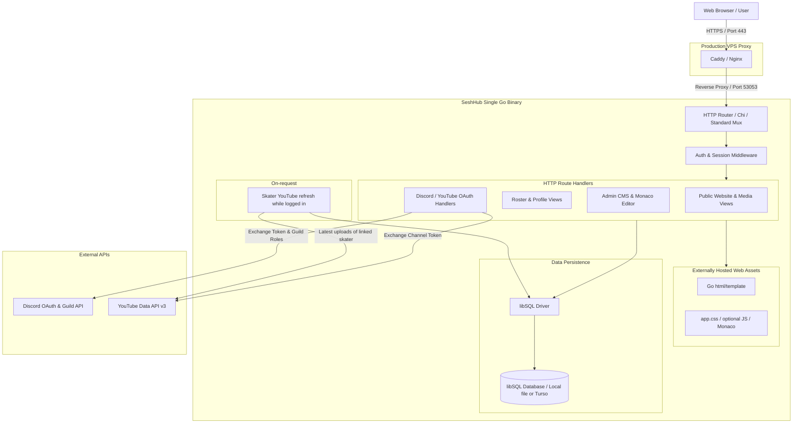

# SeshHub

SeshHub is the website and CMS for **Sesh Sofa** and the fakeskate scene. One Go process, a SQLite file, templates on disk. Public team (Discord skater role), news, videos, custom pages. Login is Discord or YouTube only — no passwords. Discord guild roles (plus a superadmin list) decide who is admin, skater, or member; everyone else can request access.

Local default listen address is **port 53053**. That port is yours. Don't let a Clanker steal it; they use `-port`.

---

## Meat Bag: get it running

### What you need

- [Go](https://go.dev/dl/) 1.22+ on `PATH`
- [just](https://just.systems/) (optional; `go run` / `go test` work without it)
- A Discord application if you want login
- A Google Cloud OAuth client if you want YouTube login

No Node, no C compiler, no Docker.

### First boot

From the repo root (PowerShell):

```powershell
copy .env.example .env
just deps
just test
just dev
```

Linux / macOS:

```sh
cp .env.example .env
just deps
just test
just dev
```

Without just:

```powershell
copy .env.example .env
go mod tidy
go test ./...
go run ./cmd/server
```

```sh
cp .env.example .env
go mod tidy
go test ./...
go run ./cmd/server
```

Open [http://localhost:53053](http://localhost:53053). Schema is applied on start into `seshhub.db`. Login buttons stay disabled until OAuth client id **and** secret are set.

Useful flags (override `.env`):

```powershell
just dev -port 127.0.0.1:53054 -db file:scratch.db
```

`-port` accepts `53054` or `host:port`. `-web` points at the `web/` folder if you moved it.

Put a real secret in `.env`:

```powershell
# SESSION_SECRET — 32+ random bytes, hex is fine
-join ((1..32) | ForEach-Object { '{0:x2}' -f (Get-Random -Max 256) })
```

Set `BASE_URL` to the same origin you type in the browser (`http://localhost:53053`). OAuth redirect URIs must match that origin exactly.

### Discord login and roles

1. [Discord Developer Portal](https://discord.com/developers/applications) → New Application.
2. **OAuth2 → Redirects**: add `http://localhost:53053/auth/discord/callback` (and later the production URL).
3. Copy **Client ID** and **Client Secret** into `DISCORD_CLIENT_ID` / `DISCORD_CLIENT_SECRET`.
4. Enable **Developer Mode** in Discord (Settings → Advanced). Right-click the Sesh Sofa server → Copy Server ID → `DISCORD_GUILD_ID`.
5. Server Settings → Roles → right-click hub admin, hosts, and skater → Copy Role ID → `DISCORD_HUB_ADMIN_ROLE_ID` / `DISCORD_HOSTS_ROLE_ID` / `DISCORD_SKATER_ROLE_ID`.
6. Right-click **your** user → Copy User ID → `SUPERADMIN_DISCORD_IDS` (comma-separated if more than one). That list is hub admin even without the guild hub-admin role, so you can log in the first time.

Scopes used: `identify`, `guilds.members.read`. Restart the server after saving `.env`. Sign in with Discord. Guild hub-admin role or superadmin → **admin**. Hosts role → can edit Spot and Episodes (independent of admin). Skater role → **skater**, and a `/team` profile is created (Discord name, linked user id). In the guild otherwise → **member**. Not in the guild → **pending** (request access at `/access`; approve at `/admin/access`). Duplicate Discord/YouTube users: **Admin → Users** → merge into the Discord row. Re-login with Discord after a hosts-role change.

### YouTube login and skater videos

One Google OAuth client. That is login, linking a channel, and (for team skaters) refreshing their latest public uploads onto their profile and `/videos`. There is no API key and no site-wide channel poller.

1. [Google Cloud Console](https://console.cloud.google.com/) → new project (or reuse one).
2. Enable **YouTube Data API v3** (OAuth calls it).
3. Credentials → **OAuth client ID** → Web application.
4. Authorized redirect URI: `http://localhost:53053/auth/youtube/callback`.
5. Copy client id/secret → `YOUTUBE_CLIENT_ID` / `YOUTUBE_CLIENT_SECRET`.
6. OAuth consent screen: add yourself as a test user while the app is in Testing.
7. Scope: `https://www.googleapis.com/auth/youtube.readonly`. We ask offline access so we can refresh uploads while the skater is logged in.

YouTube-only accounts start as **pending**. After an admin approves (or Discord guild RBAC applies), open **Account** and connect the other provider. Discord-first users connect YouTube the same way. Re-using a Discord or YouTube identity already on another SeshHub user is rejected.

Team skaters (Discord `DISCORD_SKATER_ROLE_ID`, after they log in) with a linked YouTube channel: while they are logged in, SeshHub pulls up to 50 latest uploads (at most once an hour) onto `/team/{slug}` and the public `/videos` list. Guests see the last snapshot. The skater profile row is created on Discord login.

Restart after `.env` changes. Production: add the live `https://…/auth/…/callback` URIs and set `APP_ENV=production`, `BASE_URL` to the public https origin, and a non-default `SESSION_SECRET`.

### Day-to-day

| Want | Do |
| :--- | :--- |
| Run it | `just dev` (port **53053**) |
| Tests | `just test` |
| Native binary | `just build` → `bin/seshhub` on Linux, `dist/seshhub.exe` on Windows |
| Linux binary from Windows | see [Cross-compilation](#cross-compilation) |
| Status of the repo | [`JOURNAL.md`](JOURNAL.md) — what works now vs what's next |
| Duplicate Discord + YouTube accounts | **Admin → Users** → merge from the spare into the Discord user |

---

## Specification

The rest of this file is the architecture spec (what the system is supposed to be). Code and [`JOURNAL.md`](JOURNAL.md) win when they disagree.

## Table of Contents

0. [Meat Bag: get it running](#meat-bag-get-it-running)
1. [Project Overview & Core Principles](#project-overview--core-principles)
2. [Technology Stack](#technology-stack)
3. [System Architecture](#system-architecture)
4. [Authentication & Authorization (RBAC)](#authentication--authorization-rbac)
5. [Core Functional Modules](#core-functional-modules)
   - [Skater Profiles & Team Roster](#1-skater-profiles--team-roster)
   - [YouTube clips from skaters](#2-youtube-clips-from-skaters)
   - [Articles, News & Blog CMS](#3-articles-news--blog-cms)
   - [Custom Static Pages](#4-custom-static-pages)
   - [Special page: Spot](#special-page-spot)
   - [Special page: Episodes](#special-page-episodes)
   - [Admin UI & Monaco Editor](#5-admin-ui--monaco-editor)
6. [Data Models & Database Schema (libSQL)](#data-models--database-schema-libsql)
7. [Project Directory Layout](#project-directory-layout)
8. [Configuration & Environment Variables](#configuration--environment-variables)
9. [Development & Build Workflows](#development--build-workflows)
10. [Production Deployment & Reverse Proxy](#production-deployment--reverse-proxy)
11. [AI Agent Engineering Guidelines](#ai-agent-engineering-guidelines)

---

## Project Overview & Core Principles

SeshHub is engineered around specific design principles:

- **Separately Hosted Web Assets**: HTML templates, CSS, JavaScript assets, icons, and SQL migrations are loaded from the configured web and migrations folders at runtime. This keeps the Go server binary separate from content and presentation changes, so templates and assets can be updated without rebuilding the binary.
- **Cross-Platform Parity**: Developed locally on **Windows** and deployed directly to **Linux** VPS instances. Paths, file separators, and system calls must remain platform-agnostic.
- **No Passwords / Pure OAuth**: User identity is federated exclusively through **Discord** and **YouTube** OAuth 2.0. No password hashes, email verification loops, or reset tokens are stored.
- **Discord Guild-Driven RBAC**: Permissions (Admin, Team Skater, Member) are dynamically resolved or validated against user membership and roles within the official Sesh Sofa Discord server. Users who do not match Guild RBAC, including YouTube-authenticated users, can request access for case-by-case approval by a site admin.
- **Embedded libSQL Database**: Operates using embedded SQLite-compatible libSQL (file-backed locally, optionally synced to Turso Cloud in production) with zero external database server overhead.
- **Server-Driven Dynamic UI**: Frontend powered by Go standard `html/template` and a single hand-written stylesheet (`web/static/css/app.css`). HTMX / Alpine.js only if a page actually needs them.

---

## Technology Stack

| Layer | Technology | Description |
| :--- | :--- | :--- |
| **Backend Runtime** | [Go (Golang)](https://go.dev/) (1.22+) | High-throughput, low-memory HTTP server and background worker engine. |
| **Database** | [libSQL](https://github.com/tursodatabase/libsql) | Production-grade SQLite fork supporting embedded local files and Turso cloud replication. |
| **Templating** | Go `html/template` | Standard library server-side rendered HTML with strict context-aware escaping. |
| **Interactivity** | [HTMX](https://htmx.org/) + [Alpine.js](https://alpinejs.dev/) | Declarative AJAX swaps, inline element updates, modal dialogs, and UI toggles. |
| **Styling** | Hand-written CSS | Dark neon palette in `web/static/css/app.css`. No CSS framework. |
| **Content Editor** | [Monaco Editor](https://microsoft.github.io/monaco-editor/) | In-browser Markdown and HTML editor for rich article publishing and page formatting. |
| **Identity & Auth** | Discord & YouTube OAuth 2.0 | Decentralized authentication with Discord Guild API role validation. |
| **Media** | YouTube Data API v3 via skater OAuth | Latest uploads from linked skater channels while they are logged in. |

---

## System Architecture



---

## Authentication & Authorization (RBAC)

### Authentication Flow
1. **Login Initiation**: User opens `/login` (Sesh Hub button in the header) and selects **Discord** or **YouTube**.
2. **State & PKCE**: A cryptographic `state` token is generated and stored in a short-lived, encrypted session cookie to prevent CSRF.
3. **OAuth Callback**:
   - For **Discord**: Exchange authorization code for token, fetch Discord user profile (`/users/@me`), and fetch guild member status (`/users/@me/guilds/{guild_id}/member`).
   - For **YouTube**: Exchange authorization code for Google token and retrieve Google/YouTube user and channel identity.
4. **Account Upsert or Link**: Logged out → find or create in `users`. Logged in → attach the other provider to the current user (`discord_id` / `youtube_channel_id`) unless that identity is already on another row.
5. **Session Generation**: A high-entropy session token is generated, stored in the `sessions` table (with expiration and user agent data), and returned to the browser in a secure, `HttpOnly`, `SameSite=Lax` cookie (`seshhub_session`).

### Role-Based Access Control (RBAC)

Users who do not match a Discord guild role, as well as users authenticated through YouTube, are shown an option to request user access. Requests remain pending until a site admin reviews and approves or rejects them individually in the admin UI. Approval is explicit and does not automatically grant Admin or Team Skater privileges.

| Role | Hierarchy Level | Determination Logic | Capabilities |
| :--- | :--- | :--- | :--- |
| **Admin** | Level 3 | Discord user has configured `DISCORD_HUB_ADMIN_ROLE_ID` in the Sesh Sofa Discord guild, OR user ID matches `SUPERADMIN_DISCORD_IDS`. | Hub access: Team Skaters (status), edit articles/pages, users, access queue. Not Spot/Episodes. |
| **Host** | (flag) | Discord user has `DISCORD_HOSTS_ROLE_ID` in the guild (checked on Discord login; not granted by superadmin). | Edit Spot (`/admin/spot`) and Episodes (`/admin/episodes`). Edit links only show for this flag. |
| **Team Skater** | Level 2 | Discord user has configured `DISCORD_SKATER_ROLE_ID` in the guild, OR manually designated by an Admin. | Edit own skater profile, update personal links/sponsors/clips, draft articles. |
| **Member** | Level 1 | A Discord guild member with the member role, or a user whose access request was individually approved by an Admin. | View member-exclusive media, comment/react (if enabled), link secondary OAuth accounts. |
| **Access Pending** | N/A | A user who does not match Guild RBAC or is authenticated through YouTube and has submitted an access request. | View public content while awaiting an Admin decision; no member-only access. |
| **Guest / Anonymous** | Level 0 | Unauthenticated public visitor. | View public pages, read published articles, browse the team, watch embedded videos. |

### Chrome: visitor vs Sesh Hub

Two header modes. Same public nav (Spot / Episodes / Team / News / Videos) in the dark well either way.

- **Visitor mode** (logged out): `background.png` instead of the fire field. 16:9 sofa hero, click to play `seshsofa.mp4`, Close restores the poster. Header: Discord / Twitch / YouTube icons then a Sesh Hub square to `/login`.
- **Sesh Hub mode** (logged in): hero folds into a translucent panel — `seshhub.png` (click plays the same intro; Close folds it back), then role links, **Account**, Discord avatar (also `/account`; name on hover). Display name is on the `/account` heading. **Log out** is at the bottom of `/account`. No 16:9 until the logo is clicked. `/login` redirects home.

---

## Core Functional Modules

### 1. Skater Profiles & Team Roster
- **Team Directory (`/team` / `/skaters`)**: People who hold `DISCORD_SKATER_ROLE_ID` in the guild and have logged in with Discord. Name comes from Discord; optional display name, stance, status, location, bio.
- **Skater Detail Page (`/team/{slug}`)**: Bio, stance, status, location, Discord avatar, and clips from a linked YouTube channel (optional featured pin).
- **Skater profile (`/dashboard/profile`)**: Own profile only — display name, stance, location, bio, featured clip.
- **Team Skaters (`/admin/skaters`)**: Superadmin / Discord hub-admin role only. Set another skater’s status. No add-skater form.

### 2. YouTube clips from skaters
- **No site-wide poller**: `/videos` is the union of clips pulled from team skaters who have connected YouTube.
- **Logged-in refresh**: If the user has a `skater_profiles` row, a YouTube refresh token, and last sync is older than 60 minutes, a request while they are logged in refreshes up to 50 latest uploads.
- **Manual pin**: Admins/skaters can still set `featured_video_id` from that channel’s synced rows.

### 3. Articles, News & Blog CMS
- **Publishing Workflow**: Supports `Draft`, `Published`, and `Archived` statuses.
- **Rich Content Formats**: Markdown parsing with frontmatter support and sanitized HTML rendering.
- **Featured Image & SEO**: OpenGraph tags, slug generation with uniqueness validation, excerpt generation, and reading time estimation.
- **Categorization & Tagging**: Tag clouds and category filters (News, Event Recaps, Modding, Trick Tips).

### 4. Custom Static Pages
- **Dynamic Slug Routing (`/{slug}`)**: Manage standalone pages such as `/about`, `/rules`, `/fakeskate-setup`, `/sponsors`, `/join-team`.
- **Custom Metadata**: Page title, custom navigation header/footer inclusion, and optional custom CSS injection per page for special campaign styling.

### Special page: Spot
- **De-facto homepage (`/`)**: Nav label is **Spot**. Not a custom-page slug (reserved). No `/spot` route.
- **Subotto JSON**: Fetches `https://{SUBOTTO_INSTANCE}/api/get/episode/sesh-sofa` (cached ~60s). Flattened keys (`episode_short`, `listeners.0.name`, …) fill `{{placeholders}}` in the markdown at request time. Missing keys / Subotto down → empty string.
- **Edit (`/admin/spot`)**: Hosts role only. Lists live JSON fields as copyable placeholders; one markdown box is the page. Date tags `[date_count:…]` `[date_local:…]` `[date_24h:…]` `[date_12h:…]` wrap an RFC3339 time (usually `{{air_datetime}}`); countdown ticks in the browser.

### Special page: Episodes
- **Archive (`/episodes`)**: Auto table (Episode / Submissions / Winner / Spot) with `#epN` anchors, then one heading plus configurable link rows per show (full VOD, playlists, winner, trick of the show). Winner and trick stay hidden until set. YouTube thumbs use the Videos-page `` pattern plus the heartbeat hover from the old show-site CSS. Reserved slug (not a custom page).
- **Live stub**: Same Subotto JSON as Spot. If the current episode number is missing, insert a row with content-listener playlists; `sesh-sofa-spot-challenge` is the winner-picker playlist only. Existing rows are not overwritten (blank challenge playlist / missing playlist rows can still fill).
- **Edit (`/admin/episodes`)**: Hosts role only. Edit title, counts, rows, trick URL, winner (pick from the challenge playlist when the editor has YouTube linked, or paste a watch URL; empty winner name fills from the video’s channel and can be overwritten).

### 5. Admin UI & Monaco Editor
- **Admin Control Center (`/admin`)**: Metric overviews, access queue, and **Users** (see who has Discord/YouTube, merge duplicate accounts, unlink, delete).
- **Monaco Editor Integration**: Embedded VS Code-grade Monaco Editor component on `/admin/articles/{id}/edit` and `/admin/pages/{id}/edit`.
  - Side-by-side live Markdown preview powered by Alpine.js/HTMX.
  - Syntax highlighting for Markdown, HTML, and YAML frontmatter.
  - Image uploader modal with drag-and-drop support.

---

## Data Models & Database Schema (libSQL)

```sql
-- Users and authentication
CREATE TABLE IF NOT EXISTS users (
    id TEXT PRIMARY KEY,                       -- UUID or Nanoid
    username TEXT NOT NULL,
    display_name TEXT NOT NULL,
    avatar_url TEXT,
    role TEXT NOT NULL DEFAULT 'member',      -- 'admin', 'skater', 'member'
    discord_id TEXT UNIQUE,
    discord_username TEXT,
    youtube_channel_id TEXT UNIQUE,
    youtube_channel_title TEXT,
    youtube_refresh_token TEXT,
    youtube_synced_at DATETIME,
    created_at DATETIME NOT NULL DEFAULT CURRENT_TIMESTAMP,
    updated_at DATETIME NOT NULL DEFAULT CURRENT_TIMESTAMP
);

CREATE TABLE IF NOT EXISTS sessions (
    id TEXT PRIMARY KEY,                       -- Secure random token hash
    user_id TEXT NOT NULL REFERENCES users(id) ON DELETE CASCADE,
    ip_address TEXT,
    user_agent TEXT,
    expires_at DATETIME NOT NULL,
    created_at DATETIME NOT NULL DEFAULT CURRENT_TIMESTAMP
);

-- Skater profiles and roster
CREATE TABLE IF NOT EXISTS skater_profiles (
    id TEXT PRIMARY KEY,
    user_id TEXT UNIQUE REFERENCES users(id) ON DELETE SET NULL,
    slug TEXT UNIQUE NOT NULL,
    skater_name TEXT NOT NULL,
    real_name TEXT,
    bio TEXT,
    stance TEXT DEFAULT 'regular',             -- 'regular', 'goofy', 'mongo'
    status TEXT DEFAULT 'active',             -- 'pro', 'am', 'flow', 'legend', 'inactive'
    avatar_url TEXT,
    banner_url TEXT,
    location TEXT,
    sponsors TEXT,                             -- JSON array of sponsor objects
    social_links TEXT,                         -- JSON map of platform -> URL
    signature_tricks TEXT,                     -- JSON array of strings
    featured_video_id TEXT,                    -- References youtube_videos(id)
    created_at DATETIME NOT NULL DEFAULT CURRENT_TIMESTAMP,
    updated_at DATETIME NOT NULL DEFAULT CURRENT_TIMESTAMP
);

-- Articles and announcements
CREATE TABLE IF NOT EXISTS articles (
    id TEXT PRIMARY KEY,
    slug TEXT UNIQUE NOT NULL,
    title TEXT NOT NULL,
    excerpt TEXT,
    content_raw TEXT NOT NULL,                 -- Raw Markdown
    content_html TEXT NOT NULL,                -- Sanitized rendered HTML
    featured_image_url TEXT,
    author_id TEXT NOT NULL REFERENCES users(id),
    status TEXT NOT NULL DEFAULT 'draft',      -- 'draft', 'published', 'archived'
    tags TEXT,                                 -- JSON array of tag strings
    published_at DATETIME,
    created_at DATETIME NOT NULL DEFAULT CURRENT_TIMESTAMP,
    updated_at DATETIME NOT NULL DEFAULT CURRENT_TIMESTAMP
);

-- Static custom pages
CREATE TABLE IF NOT EXISTS pages (
    id TEXT PRIMARY KEY,
    slug TEXT UNIQUE NOT NULL,
    title TEXT NOT NULL,
    content_raw TEXT NOT NULL,                 -- Raw Markdown or HTML
    content_html TEXT NOT NULL,                -- Sanitized rendered HTML
    custom_css TEXT,
    is_published BOOLEAN NOT NULL DEFAULT 0,
    created_at DATETIME NOT NULL DEFAULT CURRENT_TIMESTAMP,
    updated_at DATETIME NOT NULL DEFAULT CURRENT_TIMESTAMP
);

-- YouTube videos and sync logs
CREATE TABLE IF NOT EXISTS youtube_videos (
    id TEXT PRIMARY KEY,                       -- YouTube Video ID (e.g. 'dQw4w9WgXcQ')
    channel_id TEXT NOT NULL,
    title TEXT NOT NULL,
    description TEXT,
    published_at DATETIME NOT NULL,
    thumbnail_url TEXT NOT NULL,
    duration_seconds INTEGER DEFAULT 0,
    view_count INTEGER DEFAULT 0,
    like_count INTEGER DEFAULT 0,
    tags TEXT,                                 -- JSON array of video tags
    category TEXT,                             -- 'session', 'part', 'contest', 'short'
    is_featured BOOLEAN NOT NULL DEFAULT 0,
    is_hidden BOOLEAN NOT NULL DEFAULT 0,
    synced_at DATETIME NOT NULL DEFAULT CURRENT_TIMESTAMP
);

CREATE TABLE IF NOT EXISTS episodes (
    number INTEGER PRIMARY KEY,
    title TEXT NOT NULL DEFAULT '',
    heading TEXT NOT NULL DEFAULT '',
    submissions_count INTEGER,
    winner_name TEXT NOT NULL DEFAULT '',
    winner_video_id TEXT NOT NULL DEFAULT '',
    challenge_playlist_id TEXT NOT NULL DEFAULT '',
    note TEXT NOT NULL DEFAULT '',
    rows TEXT NOT NULL DEFAULT '[]'
);

CREATE TABLE IF NOT EXISTS sync_logs (
    id TEXT PRIMARY KEY,
    service TEXT NOT NULL,                     -- 'youtube'
    status TEXT NOT NULL,                      -- 'success', 'error', 'running'
    videos_fetched INTEGER DEFAULT 0,
    videos_inserted INTEGER DEFAULT 0,
    videos_updated INTEGER DEFAULT 0,
    error_message TEXT,
    started_at DATETIME NOT NULL DEFAULT CURRENT_TIMESTAMP,
    completed_at DATETIME
);
```

---

## Project Directory Layout

The project adheres to the standard Go project layout:

```
SeshHub/
├── cmd/
│   └── server/
│       └── main.go                  # Application entry point, CLI flags, graceful shutdown
├── internal/
│   ├── auth/                        # Discord & YouTube OAuth handlers, session management, RBAC
│   │   ├── discord.go
│   │   ├── oauth.go
│   │   ├── session.go
│   │   └── youtube.go
│   ├── config/                      # Environment parsing and app configuration
│   │   └── config.go
│   ├── db/                          # libSQL connection, migrations, query helper routines
│   │   ├── db.go
│   │   └── migrations/              # Runtime-loaded SQL migration files (.sql)
│   ├── models/                      # Go structs representing database entities
│   │   ├── article.go
│   │   ├── page.go
│   │   ├── skater.go
│   │   ├── user.go
│   │   └── video.go
│   ├── repository/                  # Database data access layer / CRUD queries
│   │   ├── article_repo.go
│   │   ├── page_repo.go
│   │   ├── skater_repo.go
│   │   ├── user_repo.go
│   │   └── video_repo.go
│   ├── services/                    # Business logic services
│   │   ├── article_service.go
│   │   ├── markdown.go              # Goldmark / Bluemonday sanitizer pipeline
│   │   ├── skater_service.go
│   │   └── youtube_sync.go          # Skater channel ingest via OAuth
│   └── web/                         # HTTP routing, middleware, and handler controllers
│       ├── handlers/
│       │   ├── admin.go             # Admin control panel and CRUD endpoints
│       │   ├── auth.go              # OAuth callback endpoints
│       │   ├── home.go              # Public home, news, and video gallery
│       │   ├── pages.go             # Custom dynamic pages handler
│       │   ├── skaters.go           # Team list and skater profile views
│       │   └── ws.go                # Optional WebSocket / SSE for live sync updates
│       ├── middleware/
│       │   ├── auth_middleware.go   # Session validation and context injection
│       │   ├── logging.go
│       │   └── rbac.go              # RequireRole(RoleAdmin), RequireRole(RoleSkater)
│       └── render/
│           └── render.go            # Template rendering engine with layout support
├── web/                             # Runtime-loaded frontend assets served separately from the binary
│   ├── static/
│   │   ├── css/                     # Site CSS (app.css)
│   │   ├── js/                      # HTMX, Alpine.js, Monaco initialization scripts
│   │   ├── img/                     # Brand icons, placeholders, default avatars
│   │   └── monaco/                  # Monaco Editor distribution assets
│   └── templates/
│       ├── layouts/
│       │   ├── base.html            # Main public shell layout
│       │   └── admin.html           # Admin dashboard shell layout
│       ├── pages/
│       │   ├── index.html           # Spot (homepage)
│       │   ├── articles_list.html   # News & articles index
│       │   ├── article_detail.html  # Single article view
│       │   ├── skaters_list.html    # Team grid
│       │   ├── skater_detail.html   # Individual skater profile
│       │   ├── videos_list.html     # YouTube video gallery
│       │   └── custom_page.html     # Generic static page template
│       ├── admin/
│       │   ├── dashboard.html       # Overview dashboard
│       │   ├── article_editor.html  # Monaco article editor with live preview
│       │   ├── page_editor.html     # Monaco page editor
│       │   ├── skater_editor.html   # Skater profile editor
│       └── partials/                # HTMX partials (modals, cards, sync toasts)
│           ├── nav.html
│           ├── footer.html
│           ├── video_card.html
│           └── skater_card.html
├── .env.example                     # Example environment variable file
├── .gitignore
├── go.mod
├── go.sum
├── Justfile                         # Development, test, and build recipes
└── README.md
```

---

## Configuration & Environment Variables

Copy `.env.example` to `.env` in your local development environment:

```ini
# ==============================================================================
# SeshHub Core Server Configuration
# ==============================================================================
APP_ENV=development                  # 'development' or 'production'
PORT=53053                           # HTTP port to listen on
BASE_URL=http://localhost:53053      # Public base URL for OAuth callbacks
SESSION_SECRET=change-me-to-a-secure-random-32-byte-hex-string
SUBOTTO_INSTANCE=subotto.seshsofa.nl # Subotto host for Spot/Episodes JSON

# ==============================================================================
# Database (libSQL / Turso)
# ==============================================================================
# For local file: "file:seshhub.db"
# For in-memory (testing): ":memory:"
# For Turso Cloud: "libsql://[your-db].turso.io?authToken=[your-token]"
DATABASE_URL=file:seshhub.db
DATABASE_AUTH_TOKEN=                 # Required only if connecting to Turso Cloud

# ==============================================================================
# Discord OAuth2 & Guild RBAC
# ==============================================================================
DISCORD_CLIENT_ID=your_discord_client_id
DISCORD_CLIENT_SECRET=your_discord_client_secret
DISCORD_GUILD_ID=your_sesh_sofa_discord_guild_id
DISCORD_HUB_ADMIN_ROLE_ID=your_hub_admin_role_id
DISCORD_HOSTS_ROLE_ID=your_hosts_role_id
DISCORD_SKATER_ROLE_ID=your_team_skater_role_id
SUPERADMIN_DISCORD_IDS=123456789012345678,987654321098765432

# ==============================================================================
# YouTube OAuth2 (login + link)
# ==============================================================================
YOUTUBE_CLIENT_ID=your_google_oauth_client_id
YOUTUBE_CLIENT_SECRET=your_google_oauth_client_secret
```

---

## Development & Build Workflows

Day-to-day setup, OAuth, and `just` recipes are in [Meat Bag: get it running](#meat-bag-get-it-running). `just` lists recipes. `go run ./cmd/server` is the same as `just dev`.

### Native build

`just build` writes a host binary: `bin/seshhub` on Linux/macOS, `dist/seshhub.exe` on Windows.

```sh
just build
./bin/seshhub
```

### Cross-Compilation

Build a self-contained Linux executable from Windows:
```powershell
$env:GOOS="linux"; $env:GOARCH="amd64"; $env:CGO_ENABLED="0"; go build -ldflags="-s -w" -o dist/seshhub-linux-amd64 cmd/server/main.go
```

Build for Windows:
```powershell
go build -ldflags="-s -w" -o dist/seshhub.exe cmd/server/main.go
```

---

## Production Deployment & Reverse Proxy

In production, run the `seshhub-linux-amd64` binary as a `systemd` service behind **Caddy** or **Nginx**.

### Systemd Service Unit (`/etc/systemd/system/seshhub.service`)

```ini
[Unit]
Description=SeshHub CMS Daemon
After=network.target

[Service]
Type=simple
User=seshhub
Group=seshhub
WorkingDirectory=/opt/seshhub
ExecStart=/opt/seshhub/seshhub
Restart=always
RestartSec=5
EnvironmentFile=/opt/seshhub/.env
LimitNOFILE=65535

[Install]
WantedBy=multi-user.target
```

### Caddy Reverse Proxy Configuration (`/etc/caddy/Caddyfile`)

```caddy
seshsofa.com, www.seshsofa.com {
    encode gzip zstd
    
    # Reverse proxy to local SeshHub instance
    reverse_proxy 127.0.0.1:53053 {
        header_up X-Real-IP {remote_host}
        header_up X-Forwarded-For {remote_host}
        header_up X-Forwarded-Proto {scheme}
    }

    # Static assets caching
    @static path /static/*
    header @static Cache-Control "public, max-age=31536000, immutable"
}
```

---

## AI Agent Engineering Guidelines

When developing features, fixing bugs, or writing tests for SeshHub, all AI coding agents **MUST** follow these rules:

1. **Runtime Web Assets**:
    - Keep templates (`.html`), styles (`.css`), scripts (`.js`), icons, and migration scripts (`.sql`) in their configured runtime folders. Do not embed them in the Go executable; this allows content and presentation changes without rebuilding the binary.
2. **Database & Queries**:
   - Write standard SQLite/libSQL-compatible SQL. Do not use PostgreSQL/MySQL-specific dialects (e.g. use `DATETIME NOT NULL DEFAULT CURRENT_TIMESTAMP`, `INTEGER PRIMARY KEY AUTOINCREMENT`, or text UUIDs).
   - Use parameterized queries exclusively (`?` placeholders) to prevent SQL injection.
3. **HTML Sanitization**:
   - When rendering user-submitted Markdown or HTML in articles or custom pages, always pass the rendered output through `bluemonday.UGCPolicy()` or equivalent strict sanitizer before marking as `template.HTML`.
4. **HTMX & Alpine.js Pattern**:
   - Prefer returning HTML partials for `hx-get`, `hx-post`, `hx-put`, `hx-delete` requests instead of full-page reloads.
   - Use `HX-Trigger` headers for toasts, modal dismissals, and client-side notifications.
5. **Cross-Platform Path Handling**:
   - Always use standard Go `filepath` or `path` modules. Never hardcode backslashes (`\`) or forward slashes (`/`) into filesystem path builders.
6. **Error Handling & Idiomatic Go**:
   - Return errors explicitly up the call stack; wrap errors with context (`fmt.Errorf("reading article %s: %w", id, err)`).
   - Never silence errors or panic in HTTP handlers. Use structured logging (`log/slog`).
7. **Monaco Editor Integration**:
    - Host Monaco editor scripts locally under `/web/static/monaco/` and serve them from the runtime web assets folder to ensure offline capability and zero CDN reliance.

---

## License

Private repository & proprietary software for the **Sesh Sofa** community. All rights reserved.


